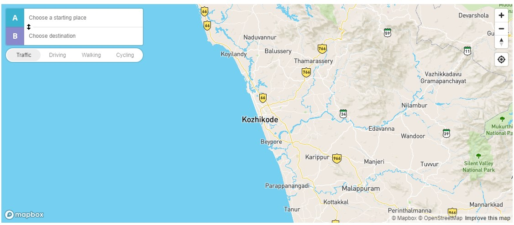

# shn_mapbox_api

This is our team repo for Saturday Hacknight conducted on may 21 ,2022

## Team members

1. SHADA FATHIMA V 
2. ZAAJIL AHAMMED KP
3. MOHAMMED AMEEN KM

# About

We've created a MAPBOX API contain features to find our live location ,
to zoom and zoom out the map , to rotate the map and  an option choose our destination through driving ,
walking and cycling .

## Build with 

  <ul>
      <li><a href="https://www.w3schools.com/html/html_intro.asp">HTML</a></li>  
      <li><a href="https://www.w3schools.com/css/css_intro.asp">CSS</a></li>  
      <li><a href="https://www.w3schools.com/js/js_intro.asp">JAvaScript</a></li>  
  </ul>
## Output

